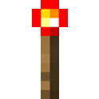
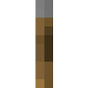
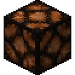

# MayRedstone Compiler Block List

The goal of this project is to optimize redstone and process it on CUDA Kernel to speeds which are largely considered impossible by using compiler techniques inspired by UnrealEngine.

# Block List

# CUDA Representation
| State                                                                   | Cuda Redstone Base | Cuda Redstone Additional | Cuda Redstone Advanced |
|-------------------------------------------------------------------------|--------------------|--------------------------|------------------------|
|   | 0                  | -                        | -                      |
|     | 1                  | -                        | -                      |
|  | -                  | 0 - 15                   | -                      |
|     | -                  | -                        | 0 - 1                  |

## Blocks
| Image                                    | Block       | Cuda | States                                                                                                                                      |
|------------------------------------------|-------------|------|---------------------------------------------------------------------------------------------------------------------------------------------|
|   | Void        | 0    |                                                                       | 
|  | Solid       | 1    |   |
|  | Transparent | 2    |                                                                       |

### Redstone

#### Power Sources [Step 1]

| Image                                                              | Block          | Cuda | States                                                                                                                                      |
|--------------------------------------------------------------------|----------------|------|---------------------------------------------------------------------------------------------------------------------------------------------|
|  | Redstone Block | 100  |                                                                         |
|  | Redstone Torch | 101  |   |
|           | Lever          | 102  |   |
|          | Button         | 103  |   |
|  | Pressure Plate | 104  |   |

#### Wiring [Step 2]

| Image                                                             | Block               | Cuda | States                                                                                                                                                                                                                                                                                      |
|-------------------------------------------------------------------|---------------------|------|---------------------------------------------------------------------------------------------------------------------------------------------------------------------------------------------------------------------------------------------------------------------------------------------|
|        | Redstone Dust       | 200  |                                                                        |
|    | Redstone Reapeater  | 210  |         |
|  | Redstone Comperator | 220  |         |

#### Run [Step 3]

| Image                                                             | Block         | Cuda | States                   |
|-------------------------------------------------------------------|---------------|------|--------------------------|
|        | Redstone Lamp | 300  |   |

# Stages

The compilation progresss will be split into stages as follows:

1. Set the powered states in the `GPU Allocation Memory`
2. Process base `Inputs` like Buttons or Plates ... and set Block powered state through `CUDA Kernel`
3. Run the `Wiring Kernel` 15 times to process dust strength
4. Run the `Base Compiler Kernel` to process redstone devices

